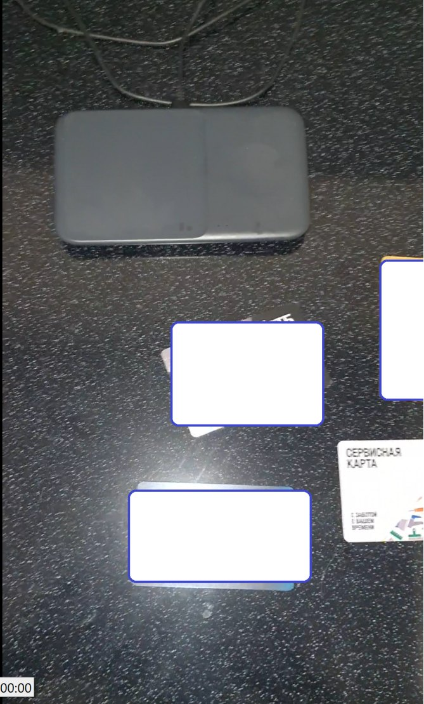
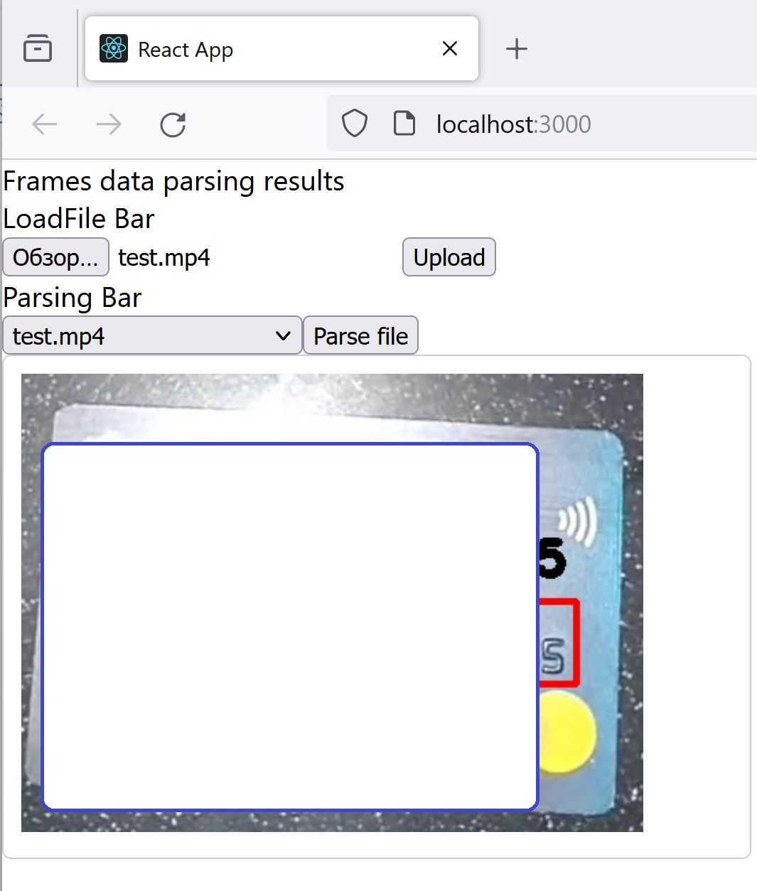

Настройки образов + наброски приложений для игр со стримом фреймов из mp4 на OpenCV + Spring Boot

Настройки образов без сессий и GPU под WSL2 на PC

<b>В порядке запуска:</b>

<b>dotwslconfig</b> - пример настроек .wslconfig

<b>kafka-brokers-conf</b> - пример поднятия топиков

<b>card-image-processing-base-java-image</b> - образ со сборкой OpenCV для JVM

<b>card-image-processing-stream-service-impl</b> - WebFlux приложение для парсинга mp4 и чтения ответа из топика (kafka topic->WebSocket)

<b>card-object-detection-service-kafka</b> - образ с Python сервисом распознавания объектов

<i>*предобученная на распознавание дебетовых карт FasterRCNN модель /card-object-detection-service-kafka/ocv/fasterrcnn_resnet50_fpn_card_0.pth ~150mb , github не поддерживает размер</i>

<b>card-text-detection-service-kafka</b> - образ с Python сервисом распознавания текста, EasyOCR без настроек

<b>card-image-processing-ui</b> - React клиент

| исходный фрейм        | результат             |
|-----------------------|-----------------------|
|  |  |